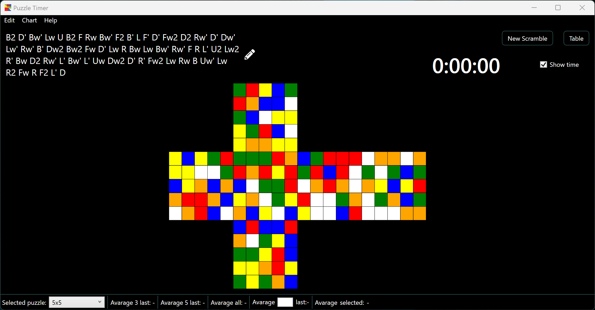

# Puzzle Timer 

### This application to generate scrambles for puzzles uses this C# library [TNoodle.NET](https://github.com/gaosui/TNoodle.NET), C# implementation of the official WCA (The World Cube Association) TNoodle project.
---
Application has:
* Generation of scrambles
* Unfolds for scrambles
* Some kind of statistics (charts, average solution time)
* Themes
* Languages
* Saving results of solutions
* Stopwatch
---
Available puzzles:
* 2x2-7x7
* Skewb
* Pyraminx
* Megaminx
---
Available theme:
* Dark
* Light
* Black
---
Available languages:
* English
* Ukrainian
* Russian

2x2 unfold:

3x3 unfold:

4x4 unfold:

5x5 unfold:

6x6 unfold:

7x7 unfold:

Skewb unfold:

Pyraminx unfold:

Megaminx unfold:

Add solution window:

Themes and languages:

